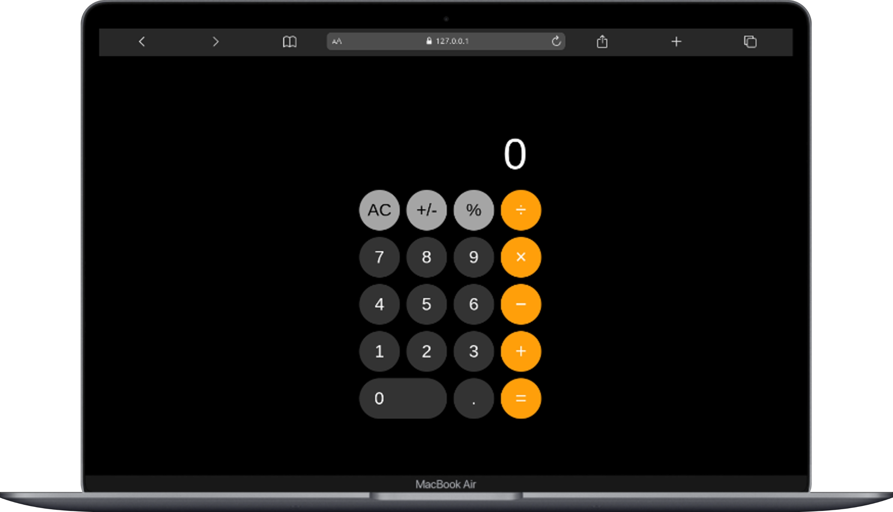
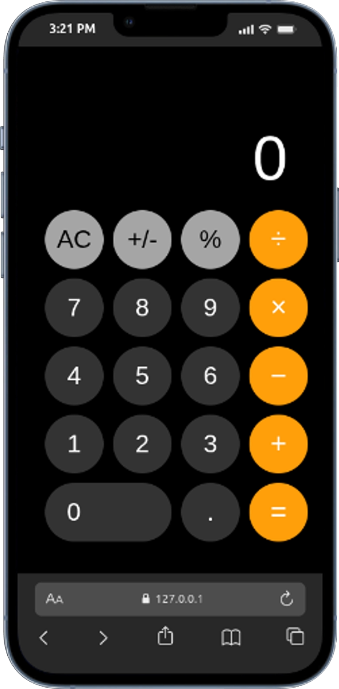
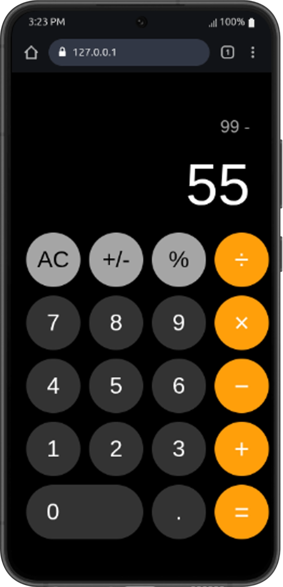

# 📱 iPhone Calculator — Web Clone

A recreation of the iPhone calculator, built from scratch using HTML5, CSS3, and Vanilla JavaScript.  
This project replicates Apple calculator design and a polished dark theme.

---

## 🎯 Project Goals

This project aims to:

- Practice semantic HTML5 and CSS without any frameworks
- Replicate a professional design with precision
- Build a fully functional calculator with JavaScript
- Implement responsive font scaling for large numbers
- Develop attention to detail in spacing, typography, and color

---

## 🧮 Features Included

- **Basic Operations**: Addition, subtraction, multiplication, division
- **Percentage Calculation**: Quick percentage conversion
- **Sign Toggle**: Switch between positive and negative numbers
- **Decimal Support**: Proper decimal handling with single decimal point
- **Operation Display**: Shows current operation and previous number
- **Operator Highlighting**: Visual feedback when an operator is selected
- **Error Handling**: Division by zero returns "Error"
- **Number Formatting**: Comma separation for thousands
- **Dynamic Font Scaling**: Font size adjusts for large numbers

---

## 🛠 Tech Stack

### Languages

- HTML5
- CSS3
- JavaScript (ES6)

### CSS Techniques Used

- CSS Grid (for button layout)
- Flexbox (for alignment)
- CSS custom properties (for colors)
- Media queries
- Transitions and animations

### Other Tools

- Git & GitHub
- VS Code

---

## 🖥 Key Features

- **Calculator Display**: Shows current input with thousands separators
- **Operation Display**: Shows pending operations (e.g., "5 +")
- **Full Button Set**: AC, +/-, %, ÷, ×, −, +, =, numbers 0-9, decimal point
- **Responsive Design**: Adapts to different screen sizes
- **Keyboard Support**: Numeric keypad and Enter key support
- **Operator Highlighting**: Selected operator turns white with orange text

---

## 📐 Design Reference

Inspired by Apple's iPhone calculator app design:

- Dark theme with black background
- Orange accent for operators
- Circular buttons with consistent spacing
- Clean, minimalistic typography

---

## 📷 Page Preview

### Desktop View



### Mobile View



### Calculator in Action



---

## 📂 Project Structure

```text
calculator/
├── index.html
├── style.css
├── script.js
└── screenshots/
    ├── desktop-view.png
    ├── mobile-view.png
    └── calculator-operation.png
```

---

## 🚀 Getting Started

Clone the repository:

```bash
git clone https://github.com/mike2377/calculator.git
cd calculator
```

Open the project in your browser:

```bash
# Simply open index.html in any browser
open index.html
```

No build tools, no dependencies — just open and go.

---

## 🧠 Challenges Faced

- **Number Formatting**: Implementing thousands separators without breaking decimal points
- **Font Scaling**: Dynamically adjusting font size based on number length
- **Operation Chaining**: Handling multiple operations in sequence (e.g., "5 + 3 - 2")
- **Operator Highlighting**: Maintaining active state while typing numbers
- **State Management**: Tracking current input, previous input, and operation

---

## 📚 What I Learned

- How to build a complete calculator with proper operation chaining
- Implementing dynamic font scaling for better UX
- Managing complex state in JavaScript
- Formatting numbers with thousands separators
- Handling edge cases (division by zero, multiple decimals)
- CSS Grid for perfect button layout

---

## 🚀 Future Improvements

- Add keyboard support for all buttons (operators, Enter, Escape)
- Add history/tape functionality to see previous calculations
- Add dark/light theme toggle
- Add sound effects for button presses
- Implement scientific calculator mode
- Add animation effects for button presses

---

## 🧪 Testing

The calculator has been tested for:

- ✅ Basic arithmetic operations
- ✅ Operation chaining
- ✅ Decimal point handling
- ✅ Division by zero error
- ✅ Negative number conversion
- ✅ Percentage calculation
- ✅ Number formatting with commas
- ✅ Font scaling for large numbers
- ✅ Operator highlighting

---

## 👨🏽‍💻 Author

**Kembou Keumoe Ivan Michael**  
Junior Fullstack Developer  
📩 Email: <kman39457@email.com>

🌍 Based in Cameroon | Open to remote opportunities
